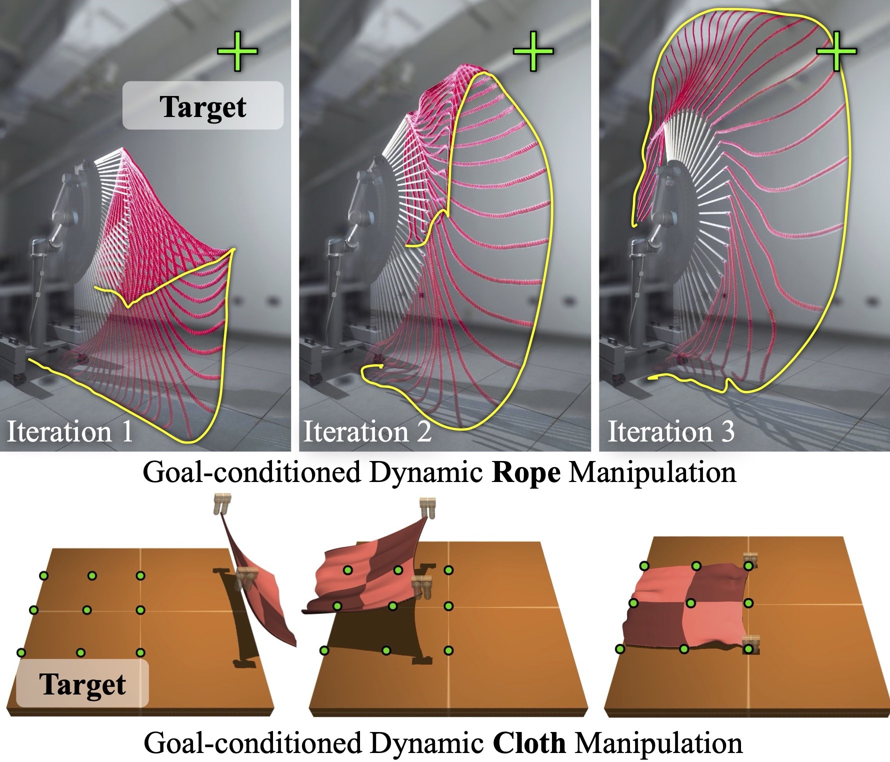
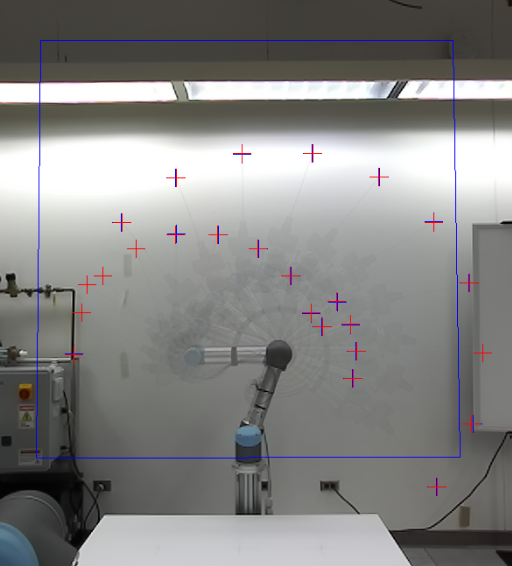

# Iterative Residual Policy
This repository contains the source code for the paper [Iterative Residual Policy for Goal-Conditioned Dynamic Manipulation of Deformable Objects](https://irp.cs.columbia.edu/). This paper has been accepted to RSS 2022.



## Cite this work
```
@inproceedings{chi2022irp,
  title={Iterative Residual Policy for Goal-Conditioned Dynamic Manipulation of Deformable Objects},
  author={Chi, Cheng and Burchfiel, Benjamin and Cousineau, Eric and Feng, Siyuan and Song, Shuran},
  booktitle={The IEEE International Conference on Computer Vision (ICCV)},
  year={2022}
}
```

## Datasets
IRP Rope Dataset [required for eval] (7.63GB)
* [Google Drive (Recommended)](https://drive.google.com/file/d/1uv7APODe6yl3vTaBLfOOz5Q9APdZdkqd/view?usp=sharing) 
* [Columbia Server](https://irp.cs.columbia.edu/data/irp_rope.zarr.tar)

IRP Cloth Dataset [training only] (938MB)
* [Google Drive (Recommended)](https://drive.google.com/file/d/1Dr88BtKbLWn8_UHTHBgbv5lhvzqvo9Dw/view?usp=sharing)
* [Columbia Server](https://irp.cs.columbia.edu/data/irp_cloth.zarr.tar)

## Pretrained Models
IRP Rope [action + tracking] (914MB)
* [Google Drive (Recommended)](https://drive.google.com/file/d/1_lODhez-JeGKbQvxHHfD3NBHBT-TSvrD/view?usp=sharing) 
* [Columbia Server](https://irp.cs.columbia.edu/data/checkpoints.tar)

IRP Cloth [action] (450MB)
* [Google Drive (Recommended)](https://drive.google.com/file/d/1K9CJKkVDS0wmpTV2alXAOoy5_UhAmkcI/view?usp=sharing)
* [Columbia Server](https://irp.cs.columbia.edu/data/irp_cloth.ckpt)

## Usage
### Installation (🖥️ Basic)
A conda [environment.yml](./environment.yml) for `python=3.8, pytorch=1.9.0 and cudatoolkit=11.2` is provided. 
```
conda env create --file environment.yml
```
Please try [mambaforge](https://github.com/conda-forge/miniforge) for better dependency conflict resolution.
```
mamba env create --file environment.yml
```

### Installation (👾 Simulation)
* Install [Mujoco 2.1.0](https://github.com/deepmind/mujoco/releases/tag/2.1.0)
* Install [mujoco-py 2.0.2](https://github.com/openai/mujoco-py) and carefully follow instructions.
* Install [abr_control](https://github.com/cheng-chi/abr_control) with Mujoco.

### Installation (🦾 Real Robot)
#### Hardware
* [Stereolabs ZED 2i Camera](https://www.stereolabs.com/zed-2i/)
* [UR5-CB3](https://www.universal-robots.com/cb3) or [UR5e](https://www.universal-robots.com/products/ur5-robot/) ([RTDE Interface](https://www.universal-robots.com/articles/ur/interface-communication/real-time-data-exchange-rtde-guide/) is required)
* [Millibar Robotics Manual Tool Changer](https://www.millibar.com/manual-tool-changer/) (only need robot side)
* 3D Print [Quick Change Plate](https://cad.onshape.com/documents/2298872dc9e43725186484ff/w/a74a4b142d00ea670de5fc6b/e/dcf3c1f5418eb0ffac59e848?renderMode=0&uiState=625c8355314d4c5f8c688959) to mount the wooden extension stick to EEF.
* 3/8 inch Square Wooden Dowel
* [8mm Cotton Rope](https://www.amazon.com/gp/product/B08TWMNV4P)
* Wood screws
* Duct tape 😛

#### Software
* Install [Zed SDK](https://www.stereolabs.com/developers/release/) and [pyzed](https://www.stereolabs.com/docs/app-development/python/install/)
* Install [ur_rtde](https://sdurobotics.gitlab.io/ur_rtde/)

### Evaluation (🖥️ Basic)
Under project root (i.e. `irp/`), create `data` folder and download [IRP Rope Dataset](#datasets) as well as [Pretrained Models](#pretrained-models). Extract tar files

```
$ cd data
$ tar -xvf checkpoints.tar
$ tar -xvf irp_rope.zarr.tar
```
Activate environment
```
$ conda activate irp
(irp) $
```
Run dataset evaluation script. Use `action.gpu_id` to select GPU on multi-GPU systems.
```
(irp) $ python eval_irp_rope_dataset.py action.gpu_id=0
```

A `log.pkl` file will be saved to the ad-hoc output directory created by [hydra](https://hydra.cc/docs/intro/). Add command-line argument `offline=False` to enable wandb logging (recommended).

Numbers reported in our paper is generated using this method.

### Evaluation (👾 Simulation)
Extract data and checkpoints following [basic](#evaluation-🖥️-basic) (required).
Install dependencies following [sim installation](#installation-👾-simulation).

Run simulation evaluation script.
```
(irp) $ python eval_irp_rope_dataset.py action.gpu_id=0
```

Note that this method has not been extensively tested and is mainly provided for future development. Mujoco might crash due to numerical instability (i.e. Nan), which is better handled in the dataset.

### Evaluation (🦾 Real Robot)
Extract data and checkpoints following [basic](#evaluation-🖥️-basic) (required).
Install dependencies following [real installation](#installation-🦾-real-robot).

Initialize UR5 robot and write down `<robot_ip>`. Move robot in teach mode close to joint configuration `[-90,-70,150,-170,-90,-90]` to prevent unexpected movement.

Run `ur5_camera_calibration_app` to create homography calibration file to `data/calibration.pkl`. Use `A/D` keys to move `j2` and `W/S` keys to move `j3`. Click on the tip of the wooden extension for calibration.
```
(irp) $ python ur5_camera_calibration_app.py --ip <robot_ip> -o data/calibration.pkl
```
Example for calibration result, the red and blue crosses should be fairly close.



Run real eval script.
```
(irp) $ python eval_irp_rope_real.py
```
Result and videos will be saved to the hydra ad-hoc output directory.

### Training
To train IRP model from scratch:
```
(irp) $ python train_irp.py
```

In case of inaccurate tracking, use `video_labeler.py` to generate tracking labels and `train_tracker.py` to train tracking model.
